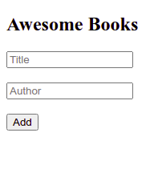

# Awesome Books Project

> A web app to add you books in a digital shelf.

Additional description about the project and its features.

## Built With

- HTML
- CSS
- JS

## Live Demo

[Live Demo Link](https://vikipretium.github.io/awesome-books-project/)

## Author

👤 **Vignesh**

- GitHub: [@vikipretium](https://github.com/vikipretium)
- Twitter: [@vikipretium](https://twitter.com/vikipretium)
- LinkedIn: [vikipretium](https://linkedin.com/in/vikipretium)

👤 **Mwafrika Josue**

- GitHub: [@mwafrika](https://github.com/mwafrika)
- Twitter: [@mwafrika](https://twitter.com/mwafrikamufung1)
- LinkedIn: [mwafrika](https://linkedin.com/in/mwafrika-mufungizi)

Contributions, issues, and feature requests are welcome!

Feel free to check the [issues page](../../issues/).

## Show your support

Give a ⭐️ if you like this project!

## Acknowledgments

- Hat tip to anyone whose code was used
- Inspiration
- etc

## 📝 License

This project is [MIT](./MIT.md) licensed.
